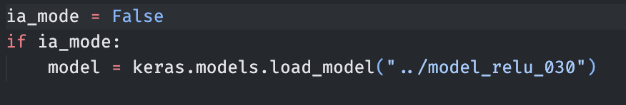
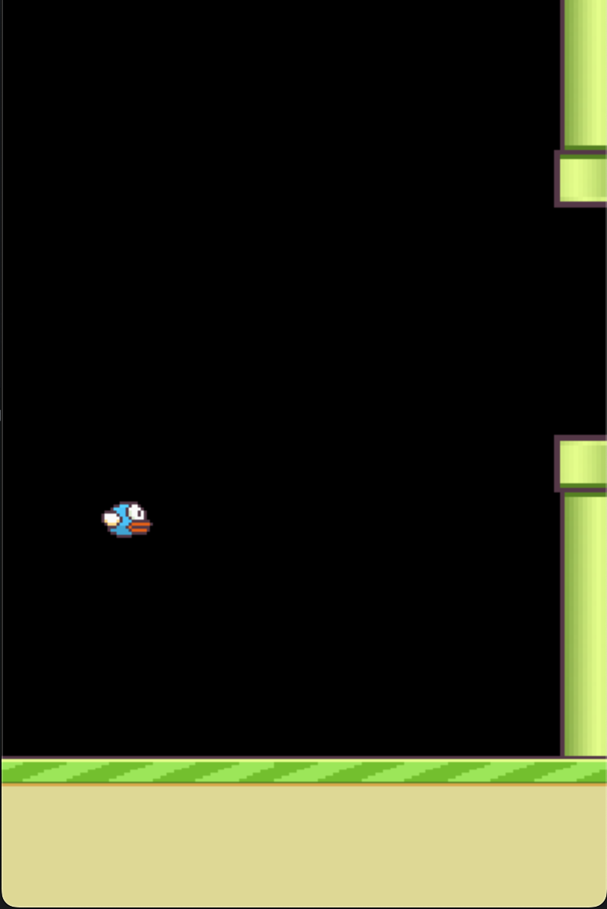
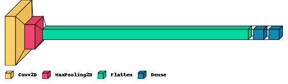

# Flappy Bot

a simple flappy Bot AI, which uses a neural network to classify ingame screenshots and decide on key presses.

> note: this repository use the flappy bird of https://github.com/LeonMarqs/Flappy-bird-python

## Requirements

- numpy
- Image
- ImageFilter
- os
- uuid
- visualkeras
- wandb
**os specific packages**
- for macos:
  - tensorflow-macos
  - tensorflow-metal
- for linux/windows:
  - tensorflow

## Quick Setup

**os specific setup**
- for macos:
  - Go on this link : https://developer.apple.com/metal/tensorflow-plugin/ and follow each step. Becareful when you install **tensorflow-macos** and **tensorflow-metal**. You should have the same version as in the **requirement.txt**.

```bash
python -m pip install tensorflow-macos==2.9.0
python -m pip install tensorflow-metal==0.5.0
```
- for linux/windows :
  - TODO


## The game


In this game, the goal is to control a bird that has to go throught pipes. If you touch the ground or a pipe, you lose the game. In this game version, to jump you should press space bar. 



If you want to play to the game, you should go in the Flappy-bird-python-dataset folder and set **ia_mode** value to false. Then you should launch the file. That will also add pictures in dataset folder.

## Learning Method

To create our AI, we chose to use the CNN (Convolutional Neural Network) architecture which is used for the image classification.

1. Change the background game in black
                


2. Resize image to 50x50


The architecture of the neural network is shown in the blueprint below. The first layer Convolves take the input image with an 3x3x1x64 kernel at strides size of 2. The output is then put in a 2x2 **Max Pooling** layer. After, the output go throught a **Flatten** layer which is mandatory in a CNN architecture because she establish the connection between the **Convolutional** layers and basic layers of the Deep Learning. We have two more hidden layer, they are **Dense** layers. the first one consists of 64 fully connected **ReLu** nodes and the last on is a 2 fully connected **SoftMax** nodes, she represent the output layer.



```bash
_________________________________________________________________
 Layer (type)                Output Shape              Param #   
=================================================================
 conv2d (Conv2D)             (None, 24, 24, 64)        640       
                                                                 
 max_pooling2d (MaxPooling2D  (None, 12, 12, 64)       0         
 )                                                               
                                                                 
 flatten (Flatten)           (None, 9216)              0         
                                                                 
 dense (Dense)               (None, 64)                589888    
                                                                 
 dense_1 (Dense)             (None, 2)                 130       
                                                                 
=================================================================
Total params: 590,658
Trainable params: 590,658
Non-trainable params: 0
```

## Training Your Own

TODO


