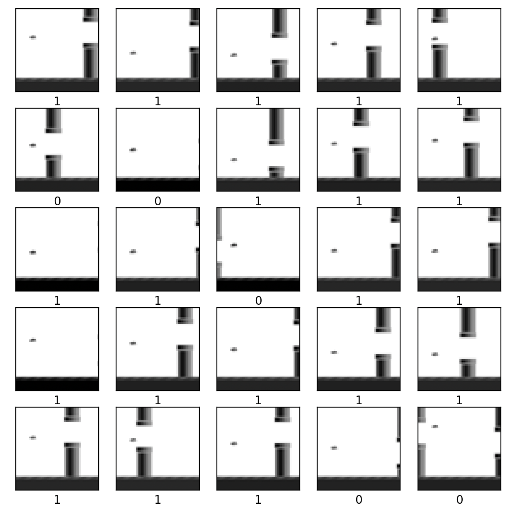

# Flappy Bot

a simple flappy Bot AI, which uses a neural network to classify ingame screenshots and decide on key presses.

> Note: this repository uses the flappy bird game of https://github.com/LeonMarqs/Flappy-bird-python as a submodule.

## Requirements

**Python modules:**
- numpy
- Image
- ImageFilter
- os
- uuid
- visualkeras
- wandb

**os specific packages**
- for macos:
  - tensorflow-macos
  - tensorflow-metal
- For Linux/Windows:
  - tensorflow

## Quick Setup

- for macos:
  - Go on this link : https://developer.apple.com/metal/tensorflow-plugin/ and follow each step. Becareful when you install **tensorflow-macos** and **tensorflow-metal**. You should have the same version as in the **requirement.txt**.

```bash
python -m pip install tensorflow-macos==2.9.0
python -m pip install tensorflow-metal==0.5.0
```

- for windows:
  - If you want to use Tensorflow with your GPU follow this installation guide: [Installation Guide with GPU](TF_GPU_WIN.md)
  - Otherwise, if you don't care about your computer burning and your fans blowing like a hurricane by using your CPU, you just need to install tensorflow with the following command:

```bash
pip install tensorflow
```

- for linux :
  - install tensorflow

## The game


In this game, the goal is to control a bird that has to go through pipes. If you touch the ground or a pipe, you lose the game. In this game version, to jump you should press space bar. 


If you want to play to the game, you should go in the Flappy-bird-python-dataset folder and set **ia_mode** value to false. Then launch the file. That will also add pictures in the dataset folder.

## Learning Method

To create our AI, we chose to use the CNN (Convolutional Neural Network) architecture which is used for the image classification.

1. Change the background game in black :
                


2. Image Processing :



3. Resize image to 50x50


The architecture of the neural network is shown in the blueprint below. The first layer Convolves takes the input image with an 3x3x1x64 kernel at strides size of 2. The output is then put in a 2x2 **Max Pooling** layer. Then, the output goes through a **Flatten** layer which is mandatory in a CNN architecture because it establishes the connection between the **Convolutional** layers and basic layers of the Deep Learning. We have two more hidden layers, they are **Dense** layers. The first one consists of 64 fully connected **ReLu** nodes and the last one is a 2 fully-connected **SoftMax** node, which represents the output layer.


```bash
_________________________________________________________________
 Layer (type)                Output Shape              Param #   
=================================================================
 conv2d (Conv2D)             (None, 24, 24, 64)        640       
                                                                 
 max_pooling2d (MaxPooling2D  (None, 12, 12, 64)       0         
 )                                                               
                                                                 
 flatten (Flatten)           (None, 9216)              0         
                                                                 
 dense (Dense)               (None, 64)                589888    
                                                                 
 dense_1 (Dense)             (None, 2)                 130       
                                                                 
=================================================================
Total params: 590,658
Trainable params: 590,658
Non-trainable params: 0
```

## Training Your Own

If you want to train the model, you should be in the **flappy-bot** folder and then launch the **train.py** file. Wait until the image mosaic appears. Click on the red cross and the model will start its training. At the end of the process, go in the **Flappy-bird-python-dataset** ans set the ia_mode variable to True. Start flappy.py and your AI will play, have fun.

## Our results

Check theses links if you want to see our different models :
   - https://wandb.ai/leo-paille/flappy-bot
   - https://wandb.ai/tristan-retali/flappy-bot 
   - https://wandb.ai/balaborde/flappy-bot

